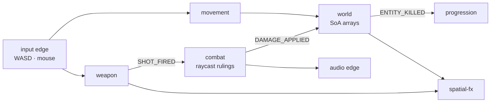

# CASE STUDY — Building an FPS with Domain PODs

> A worked example of applying the pod architecture (see pods/PLANNING.md for the
> process, pods/EVENT_FLOW.md for the Tetris instance) to a completely different
> genre: a first-person shooter. This is a DESIGN document — no code exists
> yet — but every decision here follows directly from the laws proven on L4.
>
> The core thesis it demonstrates: **the player is just an entity ID whose
> intent component gets written by a keyboard instead of an AI brain.**
> Player and NPC are indistinguishable downstream — which is the whole point.

---

## 1 · Entities as IDs in large arrays

In OOP you build a `Player` class and an `Enemy` class. Here, both are just
row indices into plain typed arrays owned by the **world pod**:

```js
// world.contract.js — Structure-of-Arrays, indexed by entityId
export function createWorldState(maxEntities = 512) {
  return {
    count: 2,
    posX: new Float32Array(maxEntities), // entity 0 = player
    posY: new Float32Array(maxEntities), // entity 1..n = NPCs
    posZ: new Float32Array(maxEntities),
    velX: new Float32Array(maxEntities),
    velY: new Float32Array(maxEntities),
    yaw: new Float32Array(maxEntities), // facing (radians)
    health: new Int16Array(maxEntities),
    team: new Uint8Array(maxEntities), // 0 = player, 1 = npc
    alive: new Uint8Array(maxEntities),
  };
}
```

"Player shoots NPC" = read arrays at index 0, write array at index 7.
No objects talking — indices into data, exactly like grid cells `[y][x]`
in Tetris.

Why SoA (separate arrays per property) instead of one object per entity:
the movement reducer touches only posX/velX/velZ; SoA keeps those contiguous
in memory. Same instinct as the spatial-fx particle pools.

## 2 · Intent sources are interchangeable

```
Tetris:  keyboard edge ──→ MOVE_LEFT, HARD_DROP   → matrix pod
FPS:     WASD edge ──────→ MOVE{vec}, AIMΔ, FIRE  → movement/weapon pods
NPC:     AI reducer ─────→ same MOVE/FIRE shapes  → same pods
```

Everything downstream — collision, damage, fx, sound — cannot tell player
from NPC and does not care. Intent SOURCES are interchangeable; consumers are
uniform. This is why the input swap (human ↔ AI ↔ replay) never touches game
logic — the same property that makes deterministic replays free in Tetris.

## 2.1 · Entity VIEWS vs entity objects — the convenience trap

Temptation: wrap each entity in a handy object holding references "for easy
access somewhere else":

```js
// ❌ WRONG — the convenience object
class Entity {
  constructor(id, world) {
    this.id = id;
    this.transform = { x: world.posX[id], y: world.posY[id] }; // COPY → stale
    this.hpRef = { get: () => world.health[id] };
    this.weapon = new Weapon(this); // object graph reborn
    this.fx = new FxHandle(this);
  }
}
```

Four failure modes:

1. **Stale copies** — `transform.x` was copied at construction; next tick the
   arrays move on. Two sources of truth that disagree. (Same disease as every
   stale-reference bug fixed in Tetris Sessions 5–8.)
2. **GC churn** — hundreds of nested objects/closures allocated per frame, or
   a parallel graph kept in sync forever. The current design allocates ZERO
   per frame.
3. **Cache death** — SoA arrays keep hot fields contiguous; scattered objects
   behind pointer hops destroy prefetching. This is what data-oriented design
   exists to prevent.
4. **Hidden reach** — `entity.weapon.fire()` lets anything call anything: the
   OOP coupling web the pods deleted.

### ✅ The correct pattern — temporary read-only VIEW

Assembled on demand inside a function; NEVER stored; reads/writes go through
to the live arrays (no copies, no staleness possible):

```js
function entityView(world, id) {
  return {
    id,
    get x() {
      return world.posX[id];
    },
    get y() {
      return world.posY[id];
    },
    get hp() {
      return world.health[id];
    },
    set hp(v) {
      world.health[id] = v;
    },
  };
}

function applyDamage(world, ev) {
  const target = entityView(world, ev.targetId); // local, dies on exit
  target.hp -= ev.amount;
  if (target.hp <= 0) {
    /* emit ENTITY_KILLED */
  }
}
```

Hot loops skip even this — pass `(world, id)` and index directly:

```js
function integrateMovement(world, id, dt) {
  world.velY[id] -= GRAVITY * dt;
  world.posY[id] += world.velY[id] * dt;
}
```

View rules:

- never stored in state, on other objects, or past the current function
- getters/setters bridge to live arrays — sugar over indexing only
- in innermost loops prefer raw indexing for speed

### Where persistent handles ARE legitimate

1. **Stable IDs, not references**: systems remember IDs ("player = entity 0",
   "killer was entity 7"). Recycled slots need generation counting
   (`id + generation * maxEntities`) so stale IDs fail loudly instead of
   silently pointing at a recycled NPC.
2. **Edge-owned singletons**: camera, audio context, canvas — framework-level
   handles like `<Render::Stage>`'s canvas. Not game state.

### LAW

> State lives in pods as flat arrays. Everything else — INCLUDING THE PLAYER
> — borrows a view by ID for the duration of one function call. If you find
> yourself storing a view/reference outside the current tick, you are
> rebuilding the object graph this architecture deleted.

---

## 3 · The pods

| Pod         | Owns                                             | Reacts to                                 |
| ----------- | ------------------------------------------------ | ----------------------------------------- |
| world       | SoA transform/health/alive arrays; death marking | DAMAGE_APPLIED                            |
| movement    | velocity integration per intent                  | MOVE                                      |
| weapon      | ammo, cooldowns, fire validation                 | FIRE, RELOAD                              |
| combat      | raycast/sweep RULINGS                            | SHOT_FIRED                                |
| spatial-fx  | tracer/muzzle/impact/explosion pools             | SHOT_FIRED, DAMAGE_APPLIED, ENTITY_KILLED |
| progression | kills, score, streaks                            | ENTITY_KILLED, DAMAGE_APPLIED             |
| session     | menus/screens                                    | unchanged from Tetris                     |

Folder layout mirrors L4 exactly:

```
app/game/domains/
├── world/          contract: SoA arrays; reducer: damage, death
├── movement/       intents + world arrays → velocities
├── weapon/         fire traps, ammo economy (powerups patterns reused)
├── combat/         raycast rulings (SHOT_FIRED → DAMAGE_APPLIED)
├── spatial-fx/     pooled particles scale naturally
├── progression/    near-verbatim port
└── session/        unchanged
```

## 4 · One mouse click, traced pod by pod

1. **input edge** → commands carrying an entity ID:
   `{type:'MOVE', id:0, vec}`, `{type:'AIM', id:0, dyaw, dpitch}`,
   `{type:'FIRE', id:0}`
2. **movement** → reads aim yaw of id 0, writes velocity/position arrays
3. **weapon** → trap on FIRE: ammo[0] > 0? cooldown ok? → emits
   `SHOT_FIRED{shooterId:0, origin, dir}`; decrements ammo
4. **combat** → consumes SHOT_FIRED: raycast vs geometry + entity volumes →
   emits `DAMAGE_APPLIED{targetId:7, amount:34, shooterId:0}`
5. **world** → `health[7] -= 34`; if ≤ 0 → `ENTITY_KILLED{id:7}`
6. **trap walls react**: fx spawns impact sparks + muzzle flash;
   progression counts kill; audio plays gunshot/hit-marker; HUD killfeed

Notice what NEVER happened: no pod called another pod. Weapon did not tell
fx "make a flash." Combat did not tell health "take damage." Every interaction
is announce-a-fact / owners-react. That IS the domain-pod connection.

---

## 5 · Event flow map (generator output, projected)

Extend `scripts/generate-event-flow.mjs` PRODUCERS:

```js
MOVE: 'input edge', AIM: 'input edge', FIRE: 'input edge',
RELOAD: 'input edge',
SHOT_FIRED: 'weapon', DAMAGE_APPLIED: 'combat',
ENTITY_KILLED: 'world', PICKED_UP: 'pickup', EXPLODED: 'explosive',
```

Projected matrix (excerpt):

| Fact           | Producer   | Consumed by               |
| -------------- | ---------- | ------------------------- |
| MOVE           | input edge | movement                  |
| FIRE           | input edge | weapon                    |
| SHOT_FIRED     | weapon     | combat, spatial-fx, audio |
| DAMAGE_APPLIED | combat     | world, progression, hud   |
| ENTITY_KILLED  | world      | progression, hud, fx      |

The ⚠️ undeclared-producer check matters MORE here: with 15+ facts across
7+ pods, an unregistered producer would otherwise be invisible.

### Macro graph



Reading the graph exposes design truths code hides:

- **world is a hub** — everything touches it, so it must stay the DUMBEST pod
  (arrays only; no behavior)
- weapon → fx direct (muzzle flash) runs parallel to weapon → combat — two
  independent reactions to one fact, zero hidden calls
- **combat is the ruling-maker** (L4 rules.js analog): decides truth, others
  apply it

---

## 6 · Runtime sequence capture (kill-cam debugger)

Chains matter more than single facts. Debug dump per tick:

```
tick 4821: FIRE{id:0}
tick 4821: SHOT_FIRED{shooter:0} → raycast hit id:7
tick 4822: DAMAGE_APPLIED{target:7, amount:34}
tick 4822: health[7]: 100 → 66
tick 4950: DAMAGE_APPLIED{target:7, amount:34}
tick 4950: health[7]: 66 → 32
tick 5100: ENTITY_KILLED{id:7, killer:0}
```

The engine already accumulates per-tick event arrays — a debug flag writing
tick-indexed facts gives a "kill-cam debugger": trace any death backwards
through its exact causal chain. For balancing ("is this gun too strong?") this
beats playtesting.

---

## 7 · The three FPS-specific traps (differences that matter)

### 7.1 Mouse aim latency — THE big one

Players perceive aim lag instantly. If mouse deltas wait for the next fixed
60Hz tick, aiming feels like wading through mud.

Solution: apply CAMERA ROTATION immediately at frame rate (outside the
accumulator); movement physics stays fixed-step. This splits one input across
two clocks — document it as a deliberate purity exception. Everything else
waits for the tick.

### 7.2 Camera is presentation, not simulation

"Rendering reads, never writes" still holds — but the camera becomes a
render-rate consumer interpolating between the last two sim ticks so motion
stays smooth at any refresh rate.

### 7.3 Collision is real math now

Grid cells were free collision. FPS needs swept shapes against geometry —
swept-AABB first before considering full physics middleware. Biggest new
scope item by far.

(Multiplayer adds client prediction + server reconciliation — defer entirely;
single-player first.)

---

## 8 · Why FPS suits pods BETTER than Tetris in one way

Damage events, bullet impacts, kill confirmations — dense streams of small
facts consumed by many independent listeners (fx, audio, scoreboard, HUD
killfeed). That is precisely the trap-wall pattern pods excel at. Pooled
particle discipline extends naturally to tracer pools, decal pools, shell
casing pools.

And determinism carries over identically: record the command stream per tick
→ perfect replays/kill-cams, testable combat without rendering, spectators
added without touching logic.

---

## 9 · Build-order recommendation

1. world pod + movement pod + camera exception (aim at frame rate) — get
   WASD-mouse feeling right FIRST; feel problems here doom everything else
2. weapon pod + hitscan combat (raycast) + DAMAGE_APPLIED loop
3. fx pools (tracer, impact) + audio voices
4. NPC AI pod emitting the SAME intent commands (proves interchangeability)
5. pickup/economy pods (weapon/ammo patterns reuse)
6. THEN consider bloom/post chain and polish layers

Steps 1–2 are the risk gate: if aim feel fails after step 1, iterate there —
do not build content on top of bad controls.
