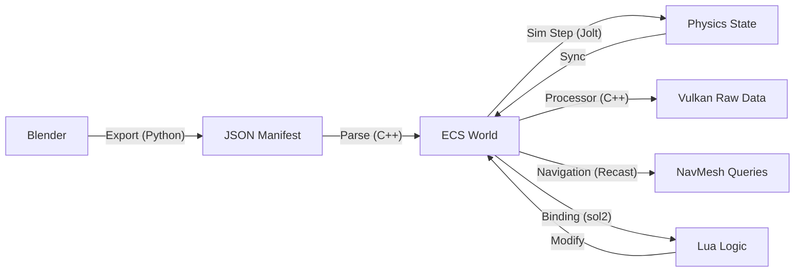

# Unified Workflow: Blender → JSON → ECS → Lua
## The Common Language of Gameplay

The combination of a professional DCC tool, a flexible manifest format, and a component-first engine is the **"Golden Standard"** for custom engine development. 

### 💡 The Core Philosophy: ECS as the Common Language
The single most important takeaway of this architecture is that **ECS is the Universal Vocabulary** for the entire engine. It is the technical bridge that allows wildly different systems (Rendering, Physics, AI) to talk to each other without specialized glue code.

1.  **Blender speaks it** through "Component Tags."
2.  **Lua speaks it** by mutating "Component Data."
3.  **Vulkan speaks it** by rendering "Component Arrays."

Because everything speaks the same language, the engine becomes an **Emergent System**—where complex gameplay arises from simple data transformations.

## 1. The Data Flow Pipeline
The strength of this architecture lies in its linear, predictable data flow.

## 2. Why They Play Well Together

### A. Tags to Components
In Blender, you don't care about C++ classes. You care about **Tags**. 
- **Blender Property**: `physics_type: "DYNAMIC"`
- **JSON**: `"physics_type": "DYNAMIC"`
- **ECS**: The loader adds a `RigidBody` component.
- **Physics**: Jolt picks it up and starts simulating gravity/collisions.
- **Lua**: A script can apply forces to the handle.

### B. Composition over Inheritance
This is where the system shines. To create a "Boss", you don't code a `Boss` class. 
1.  **Blender**: You place a high-poly Dragon mesh.
2.  **Blender**: You add a `FireBreath` component tag.
3.  **Blender**: You add a `lua_script: "boss_ai.lua"` tag.
4.  **Blender**: You add `collider: "CONVEX_HULL"` for physics.
5.  **Engine**: The multithreaded **PhysicsSystem (Jolt)** handles the collisions, the **DamageSystem (C++)** handles the hits, and **Lua** handles the complex dialogue and phase transitions.

### C. Prefabs & Parallelism
- **Prefabs**: Your JSON can "Nest" prefabs. A "Town Square" prefab in JSON can contain hundreds of entities, all of which are instantiated into the ECS in one batch operation.
- **Parallel Processors**: Because the ECS organizes components in tight, contiguous arrays, your C++ "Processors" can saturate all CPU cores while Physics, Animation, and Lua run safely in parallel on their own high-level tasks.

## 3. The Iteration Loop (Developer Experience)
This triad creates an incredibly fast iteration loop:
1.  **Edit in Blender**: Move a wall, change a light color, adjust a collider shape, or add a script tag.
2.  **Export & Reload**: The engine re-parses the JSON. No C++ recompilation is needed.
3.  **Hot-Reload Lua**: If you change the `boss_ai.lua` script, you can reload it while the game is running. The ECS state (position, health, physics velocity) remains intact.

## 4. Architectural Summary
- **Blender** handles **Design & Hierarchy**.
*   **JSON** handles **Serialization & Persistence**.
*   **ECS** handles **Memory, Performance, & Multithreading**.
*   **Physics/Navigation** handles **Simulation & Constraints**.
*   **Lua** handles **Dynamic Complexity & Gameplay Variety**.

### The "Unified Entity" Concept
In this workflow, a **Player** and an **AI** are the same thing: a composition of components. This allows your **Damage System**, **Animation System**, and **Rendering System** to be completely agnostic of "who" they are processing, leading to massive code reuse and emergent interactions.

This is a **High-Performance + High-Flexibility** stack. It allows you to build a complex game without fighting the C++ compiler every time you want to move a health pack or change a door’s opening speed.
